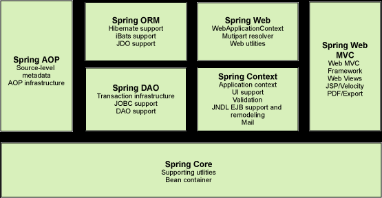

### 什么是Spring框架,Spring框架有哪些主要模块

> Spring Framework 是一个开源的Java／Java EE全功能栈（full-stack）的应用程序框架，以Apache License 2.0开源许可协议的形式发布，也有.NET平台上的移植版本。该框架基于 Expert One-on-One Java EE Design and Development（ISBN 0-7645-4385-7）一书中的代码，最初由Rod Johnson和Juergen Hoeller等开发。Spring Framework提供了一个简易的开发方式，这种开发方式，将避免那些可能致使底层代码变得繁杂混乱的大量的属性文件和帮助类。[from wikipedia: Spring Framework](https://zh.wikipedia.org/wiki/Spring_Framework)

> Spring 是一个开源框架，是为了解决企业应用程序开发复杂性而创建的。框架的主要优势之一就是其分层架构，分层架构允许您选择使用哪一个组件，同时为 J2EE 应用程序开发提供集成的框架。[ from IBM - Spring 框架简介](https://www.ibm.com/developerworks/cn/java/wa-spring1/index.html)

Spring 框架是一个分层架构，由 7 个定义良好的模块组成。Spring 模块构建在核心容器之上，核心容器定义了创建、配置和管理 bean 的方式。

http://www.runoob.com/w3cnote/basic-knowledge-summary-of-spring.html

### 使用Spring框架能带来哪些好处

### 什么是控制反转（IOC）,什么是依赖注入

### Spring中的IOC

### BeanFactory和ApplicationConext有什么区别

### Spring有几种配置方式,分别如何配置

### SpringBean的生命周期

### SpringBean的作用域及区别

### 什么是Spring inner beans

### Spring框架中的单例Beans是线程安全的么

### 如何在Spring中注入一个Java Collection

### 如何向Spring Bean中注入一个Java.util.Properties

### 自动装配模式,Spring Bean如何自动装配

### 举例解释@Required注解和@Autowired注解

